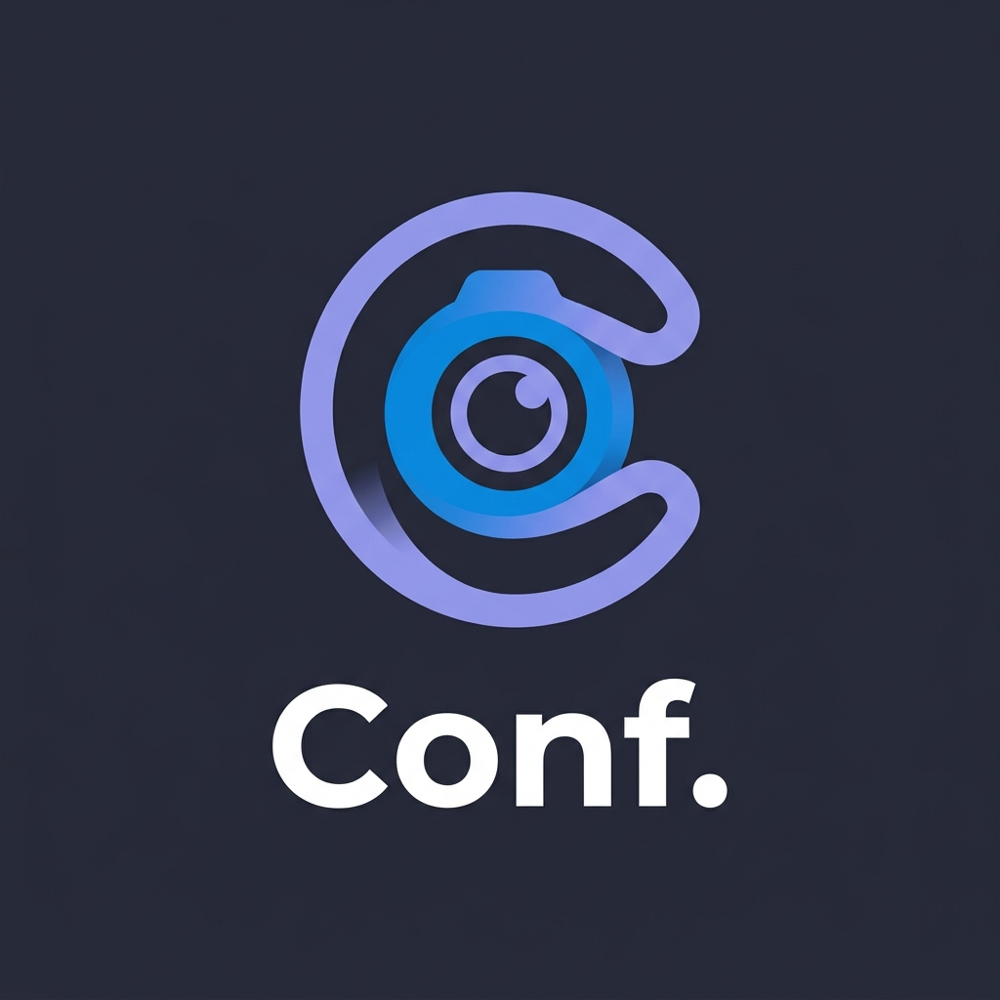

# Conf. — Premium Video Conferencing

**Conf.** is a minimalist, secure, and mobile-responsive video conferencing wrapper designed for high-performance virtual meetings. Built with a modern glassmorphism aesthetic and a custom-tailored dark theme, it provides a premium experience with zero installation required.

## 🚀 Features

- **Instant Meetings**: Create or join rooms in seconds.
- **HD Video & Audio**: Crystal clear communication powered by the MiroTalk SFU engine.
- **Personalized Access**: Custom display names and saved "Recent Rooms" for quick re-entry.
- **Modern UI**: Bespoke design system with glassmorphism, responsive layouts, and elegant animations.
- **Share with Ease**: Built-in branded sharing modal with dynamic QR codes.
- **Privacy First**: No tracking, no data storage, and zero friction.

## 🛠️ Technology Stack

- **Frontend**: Vanilla HTML5, CSS3, JavaScript.
- **Iconography**: Lucide Icons & Custom SVGs.
- **Video Engine**: [MiroTalk SFU](https://sfu.mirotalk.com/) (Embedded via Iframe API).

## 📜 Credits & License

**Conf.** is a branded wrapper and UI implementation. The underlying video conferencing technology is powered by **MiroTalk SFU**, an amazing open-source Web RTC engine.

- **Engine Credit**: [MiroTalk SFU](https://github.com/miroslavpejic85/mirotalksfu) by Miroslav Pejic.
- **UI/UX Design**: Antigravity (Google DeepMind Team).

---

## 🔧 Installation & Deployment

This is a static web application. To deploy it:

1. Clone or download this repository.
2. Host the files on any web server (Apache, Nginx, GitHub Pages, etc.).
3. Access `index.html` through your browser.

*Note: Ensure your server supports HTTPS for camera and microphone access.*

---

© 2026 Conf. Video. All rights reserved.
